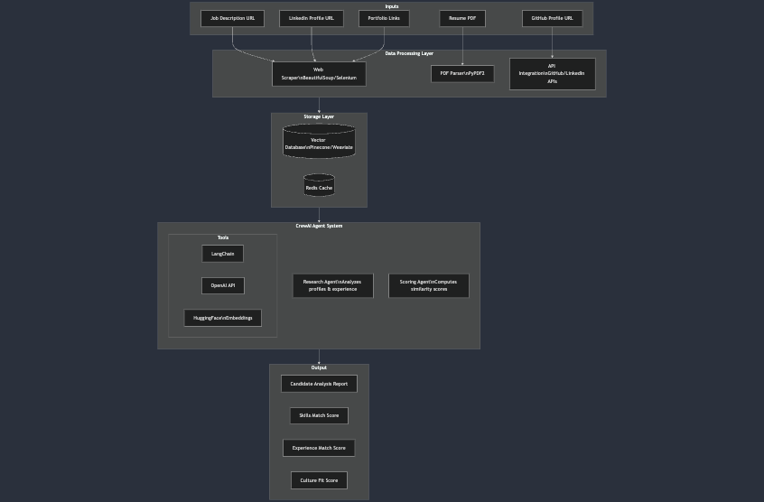

# AI-Powered Candidate Screening System

A multi-agent LLM system that analyzes and scores candidates for software engineering roles by comparing their profiles against job requirements. Built using CrewAI and LangChain.


## 🎯 Current MVP Features

- Job posting analysis and requirement extraction
- Resume parsing and analysis
- Multi-agent system for research and scoring
- Basic candidate-job similarity scoring
- Profile aggregation (Resume, LinkedIn, GitHub)

## 🚀 Quick Start

### High level design



### Prerequisites
- Python 3.9+
- OpenAI API key

### Installation

```bash
# Clone the repository
git clone https://github.com/yourusername/candidate-screening-system.git
cd candidate-screening-system

# Create and activate virtual environment
python -m venv venv
source venv/bin/activate  # or .\venv\Scripts\activate on Windows

# Install dependencies
pip install -r requirements.txt

# Set up environment variables
cp .env.example .env
# Add your API keys to .env file
```

### Basic Usage

```python
from screening_system import CandidateScreeningSystem

# Initialize the system
screener = CandidateScreeningSystem()

# Process a candidate
result = screener.process_candidate(
    job_url="https://example.com/job-posting",
    resume_path="path/to/resume.pdf",
    linkedin_url="https://linkedin.com/in/candidate",
    github_url="https://github.com/candidate"
)

# Print results
print(result.scores)
print(result.analysis)
```

## 📁 Project Structure

```
candidate-screening-system/
├── agents/
│   ├── research_agent.py
│   └── scoring_agent.py
├── utils/
│   ├── job_scraper.py
│   └── resume_parser.py
├── test_screening.py
├── main.py
├── requirements.txt
└── .env
```

## 🛠️ Current Implementation

### 1. Data Collection
```python
# Example of current job scraping implementation
class JobScraper:
    def extract_job_details(self, url):
        response = requests.get(url)
        soup = BeautifulSoup(response.text, 'html.parser')
        # Basic scraping logic
        return {
            'title': extracted_title,
            'description': extracted_description,
            'requirements': extracted_requirements
        }
```

### 2. Agent System
```python
# Example of current agent implementation
class ResearchAgent:
    def __init__(self):
        self.agent = Agent(
            role='Research Analyst',
            goal='Analyze candidate profiles and extract relevant information',
            backstory='Expert at analyzing technical profiles and experience',
            allow_delegation=False,
            llm=OpenAI(temperature=0.7)
        )
```

## 🔄 Current Workflow

1. Input Processing
   - Job posting URL processing
   - Resume PDF parsing
   - Profile URL collection

2. Research Phase
   - Profile analysis
   - Experience verification
   - Skill extraction

3. Scoring Phase
   - Skills matching
   - Experience evaluation
   - Overall compatibility score

4. Output Generation
   - Scoring summary
   - Candidate analysis report

---

# 🚀 Post-MVP Roadmap

## 1. Enhanced Data Processing
- [ ] Advanced rate limiting for web scraping
- [ ] Improved PDF parsing with multiple formats support
- [ ] Integration with more job posting platforms
- [ ] Custom OCR for non-standard resume formats

## 2. Infrastructure Improvements
- [ ] Implement Redis caching layer
- [ ] Add Vector database (Pinecone/Weaviate) integration
- [ ] Set up proper logging system
- [ ] Add monitoring and alerting

## 3. Advanced Agent Capabilities
- [ ] Add specialized agent for cultural fit assessment
- [ ] Implement agent for technical skill verification
- [ ] Add collaborative decision making between agents
- [ ] Include market research agent for salary analysis

## 4. API and Interface
- [ ] Build RESTful API with FastAPI
- [ ] Create admin dashboard
- [ ] Add batch processing capabilities
- [ ] Implement webhook notifications

## 5. Advanced Features
- [ ] Machine learning-based scoring refinement
- [ ] Candidate recommendation system
- [ ] Automated follow-up questions generation
- [ ] Interview question suggestion based on profile gaps

## 6. Security and Compliance
- [ ] Implement role-based access control
- [ ] Add data encryption at rest
- [ ] GDPR compliance features
- [ ] Data retention policies

## 7. Integration Capabilities
- [ ] ATS (Applicant Tracking System) integration
- [ ] Calendar integration for scheduling
- [ ] Email automation for candidate communication
- [ ] Integration with popular HR platforms


---

**Note**: This is an active project under development. Features and implementation details may change.